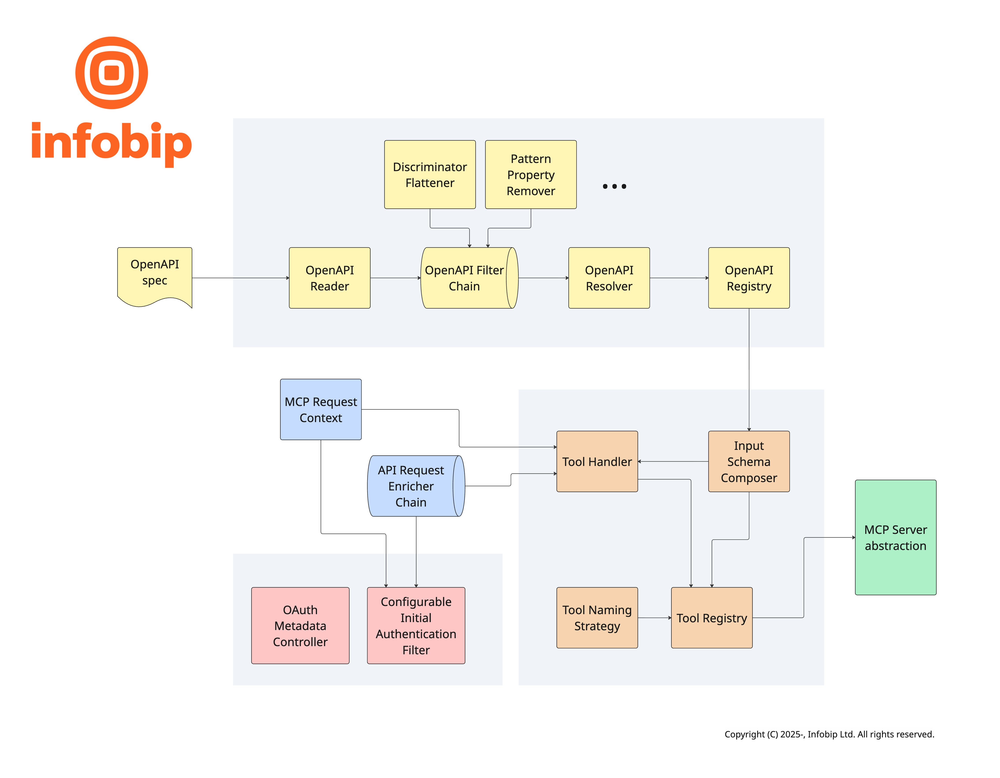

# Infobip OpenAPI MCP


Infobip OpenAPI MCP is a framework for exposing [OpenAPI][1] documented HTTP APIs as [MCP][2] servers. It is based
on [Spring AI][3] and made to run as a [Spring Boot][4] application. It is powering [Infobip's own MCP servers][5], and
you can use it to implement your own MCP servers.

## Features

The framework is a bridge from the OpenAPI described APIs to MCP servers. Core functionality is mapping HTTP API
operations (paths and HTTP methods) to MCP tools. This includes a setup step that happens upfront to prepare tool
metadata which is presented to AI agents and a runtime step that happens when AI agents invoke tools.

Some of the core features include:

- Adapting OpenAPI specification to work with MCP tools. APIs have more flexibility in their inputs, e.g. they accept
  path and query parameters, while MCP tools expect to receive all inputs as a single JSON object. The framework will
  detect these cases and wrap / unwrap inputs accordingly.
- OpenAPI specification allows advanced features in request schema definitions, such as discriminators for polymorphic
  models. This is not allowed in pure JSON schema used by MCP, so the framework has a transformation step in which
  discriminators are resolved and embedded in a way compatible with JSON schema.

> [!IMPORTANT]
> The OpenAPI MCP framework allows you to expose any HTTP API documented with OpenAPI to LLM agents. Since LLMs will
> process the API responses it is important that you trust the API won't compromise your users' agents with prompt
> injections. It is equally important to trust the OpenAPI specification, as it is used as a source of meta-data that is
> directly provided to LLMs. When exposing your own APIs make sure that responses are secure and can't be used to inject
> untrusted text that might contain prompt injection. When exposing 3rd party APIs make sure the API itself is trusted,
> but also that the OpenAPI specification which defines it is equally trusted. When working with 3rd party OpenAPI
> specifications you can review and store them as a static files inside your application resources. That way you can be
> sure specifications won't change unexpectedly.

### Authentication

Authentication and authorization is important for MCP servers, and can be tricky to implement. In case of exposing HTTP
APIs as MCP tools the security posture of the API is bases for everything. The OpenAPI MCP framework adapts it to MCP
specification in few key ways:

- The framework exposes required `/.well-known` HTTP endpoints. Two of them (`/.well-known/openid-configuration` and
  `/.well-known/oauth-authorization-server`) are proxied to your [authorization server][5], and one (the
  `/.well-known/oauth-protected-resource`) is handled by the framework itself.
- There is the option of supporting authorization checking API endpoint that framework invokes before processing MCP
  interactions to validate client credentials.

Lastly, by delegating authentication to dedicated API endpoint, the framework supports arbitrary auth type, such as
classic API key and Basic auth types, in addition to OAuth.

There are more technical features that enable customizing various behaviors, like:

- OpenAPI filters that can be used to programmatically customize the specification before MCP tool metadata is
  constructed.
- [OpenAPI extensions][7] that can be used to customize different aspects of MCP tools, including listing custom OAuth
  scopes.
- Several naming strategies are available to customize MCP tool names.
- API request enrichers that can be used to programmatically customize the API requests that back the tool calls.
- A base of [Spring AI][3] external customization options, which framework builds on top of with its own options. See
  below for a full list.

## Getting Started

### Prerequisites

OpenAPI MCP framework requires Java version 21 of newer, and is based on [Spring Boot][4] `3.5.x` and [Spring AI][3]
`1.1.x`.

### Installation

You can install it in your Java project with maven:

```xml

<dependency>
    <groupId>com.infobip.openapi.mcp</groupId>
    <artifactId>infobip-openapi-mcp-spring-boot-starter</artifactId>
    <version>0.1.0</version>
</dependency>
```

or gradle:

```groovy
implementation("com.infobip.openapi.mcp:infobip-openapi-mcp-spring-boot-starter:0.1.0")
```

## Usage

After installation enable one of the [server protocols supported by Spring AI][8] with externalized configuration
properties. For example, you can enable [stdio transport][9] with a config like this:

```yaml
spring:
  ai:
    mcp:
      server:
        type: sync
        stdio: on
```

> [!IMPORTANT]
> Make sure to set the server type to `sync`, as some of the framework features (such as authentication) will not work
> with the `async` type.

To expose a remote server using the currently recommended [streamable HTTP transport][10] use this config:

```yaml
spring:
  ai:
    mcp:
      server:
        protocol: STATELESS
```

## Configuration

### OpenApiFilter

You can implement and register beans of type `com.infobip.openapi.mcp.openapi.filter.OpenApiFilter` to change the
OpenAPI specification before framework extracts MCP tool meta-data from it. Individual filters can be disabled in
externalized configuration with the `infobip.openapi.mcp.filters.[filter-name]` property. For example, to disable the
built-in filter that removes regex pattern property from OpenAPI schemas set
`infobip.openapi.mcp.filters.PatternPropertyRemover: false`.

> [!TIP]
> AI agents perform best with smaller, focused MCP servers. On the contrast, HTTP APIs are ofter large and full of
> different features. This means we usually need to pick a subset of API operations that will be included as tools.
> Sometimes we need to also pick a limited subset of input parameters like query parameters or even request body
> properties. There are two ways to prepare OpenAPI specification for this:
>
> 1. You can make a dedicated OpenAPI specification for your MCP servers. This can be done either from scratch, or by
     transforming the original specification with something like [OpenAPI overlays][12]. This transformation can be
     automated as part of your CI pipeline. In this case your MCP server will receive the limited-scope specification
     with only the elements that you selected to expose to AI agents.
> 2. Alternatively, you can provide MCP server with the original, fully featured specification and narrow down its scope
     by implementing OpenAPI filters in your application code.
>
> Both approaches can be combined.

### Tool NamingStrategy

MCP servers expose functionalities to AI agents as tools. Each tool is identified by a name which is accompanied by a
description. LLMs pick tools to use based on this information, so it is important to make them concise and clear. The
framework implements several strategies for naming tools:

1. `OperationIdStrategy`, which produces names based on `operationId` from OpenAPI specification.
2. `SanitizedOperationIdStrategy` which uses `operationId`, but sanitizes it by lowercasing alphanumeric characters and
   replacing others with underscore.
3. `EndpointStrategy`, which combines HTTP method and path.

Various MCP client libraries have different limitations on the maximum tool name length. To accommodate this the
framework provides `TrimNamingStrategy`, which wraps one of the base strategies and enforces length limits on top of it.

You can customize tool naming with `infobip.openapi.mcp.tools.naming.strategy` and
`infobip.openapi.mcp.tools.naming.max-length` external configuration properties. If provided implementations do not meet
your needs you can provide your own implementation.

> [!TIP]
> Many MCP client libraries implement scoping of tool names. Common pattern is to allow client applications to name each
> MCP server they connect to, and to prepend the server name to names of tools loaded from the server. This means you as
> MCP server developer do not need to scope your tool names. It is best to keep names short and to the point.

### Tool descriptions

LLMs pick tools based on their names and descriptions. In order for them to be able to do that descriptions of all tools
from all MCP servers that an agent is connected to are loaded into LLM context. This means that tool descriptions need
to be as short as possible while retaining clarity, but not shorter than that.

The OpenAPI MCP framework can use few API operation properties to create tool descriptions. It can either take just the
operation summary, or it can combine it with operation description. The behavior can be controlled with
`infobip.openapi.mcp.tools.prepend-summary-to-description` externalized configuration property.

### Authentication

MCP defines OAuth as preferred authentication method. The framework aims to make this as easy to implement as possible.
There are few considerations when exposing existing APIs:

1. The underlying API must implement the same authentication type as MCP server.
2. There are few specifics of MCP specification that need to be satisfied for clients to work automatically.

One of MCP requirements is that first interaction with MCP server that doesn't include valid credentials should be
rejected; in fact that is what triggers the login flow in MCP clients. However, this interaction is usually not direct
tool invocation, meaning that the framework does not need to make any API calls to implement tool calls. Since
credentials still need to be verified framework needs to invoke some API endpoint which only performs the
authentication. This special endpoint, which is not exposed as a tool but is used only in this auth flow, needs to be
defined in an externalized configuration property `infobip.openapi.mcp.security.auth.auth-url`. This is needed whenever
security is enabled. The framework will pass any `Authorization` header from the inbound MCP request to the `auth-url`
endpoint on the API.

#### OAuth

MCP specification defines a flow for automatic [authorization server discovery][13]. One of the requirements is that MCP
server itself should expose few `/.well-known` HTTP endpoints defined by the OAuth specification. Some of these are
usually implemented by the OAuth authorization server, and the OpenAPI MCP framework can proxy those calls to make it
more convenient to expose them from the same server as the rest of MCP features. Some endpoints are implemented and
exposed directly by the framework, as in acts as OAuth resource server.

OAuth APIs usually rely on scopes for fine-grained access control, and MCP specification allows for this. OpenAPI MCP
framework takes the OAUth scope information from the provided OpenAPI specification. The framework looks for scopes
either in standard security properties or in custom operation-level OpenAPI extensions that can be defined in
`infobip.openapi.mcp.security.auth.oauth.scope-discovery.scope-extensions`. Additionally, fixed, predefined scopes can
also be defined with `infobip.openapi.mcp.security.auth.oauth.scope-discovery.mandatory-scopes`.

You can configure what set from all discovered scopes are requested during login by setting the externalized
configuration property `infobip.openapi.mcp.security.auth.oauth.scope-discovery.calculate-minimal-scopes`. When `NONE`
is used, which is the default, all discovered scopes are requested. When `GREEDY` is used an optimistic greedy algorithm
picks a subset of scopes which still covers all operations.

### ApiRequestEnricher

If you need to customize HTTP requests that the framework is making towards the API you can implement and register beans
of type `com.infobip.openapi.mcp.enricher.ApiRequestEnricher`. This is a good place to include any meta-data for
monitoring or custom tracing that you may need. Framework provides few enrichers out of the box, for example the one
that sets the `User-Agent` header to the value defined in externalized configuration property
`infobip.openapi.mcp.user-agent`.

> [!NOTE]
> Implementations of API request enrichers should be lightweight and non-critical. The framework will skip enrichers
> that fail by catching any exceptions and carry on to make the API request. This is why the enricher interface is
> limited
> to tweaking Spring's `RestClient.RequestHeadersSpec` and does not provide options to break the flow and prevent the
> API
> call from being made.

### JSON serialization

Both MCP client libraries and underlying LLMs can sometimes produce invalid JSON documents and send them to MCP server
tools. The OpenAPI MCP framework implements a helper to address one of the common errors: embedding JSON sub-objects
into strings. This is a common failure mode in which a sub-object property of a complex request model is sent to MCP
server inside a JSON string. The framework will first send this request to HTTP API as normal, but will likely receive a
HTTP status code `400` response. In that case framework will attempt to unwrap string property values and look for a
JSON object or a JSON array inside it. If it detects such a case, it sends another HTTP API requests with the corrected
request body.

You can disable this behavior by setting externalized configuration property
`infobip.openapi.mcp.tools.json-double-serialization-mitigation: false`.

### Properties

[External configuration properties][11] that can be used to configure framework behavior:

| Property                                                                           | Description                                                                                                                                                                                                                                                                                                                                             | Default        |
|------------------------------------------------------------------------------------|---------------------------------------------------------------------------------------------------------------------------------------------------------------------------------------------------------------------------------------------------------------------------------------------------------------------------------------------------------|----------------|
| `infobip.openapi.mcp.open-api-url`                                                 | URL to the OpenAPI specification. This should point to a valid OpenAPI document (e.g., JSON or YAML).                                                                                                                                                                                                                                                   | `-`            |
| `infobip.openapi.mcp.api-base-url`                                                 | Base URL for the API. This is used to construct the full URLs for the API endpoints.                                                                                                                                                                                                                                                                    | `-`            |
| `infobip.openapi.mcp.connect-timeout`                                              | Connection timeout for HTTP requests to the downstream API. The default is set to 5 seconds.                                                                                                                                                                                                                                                            | 5 seconds      |
| `infobip.openapi.mcp.read-timeout`                                                 | Read timeout for HTTP requests to the downstream API. The default is set to 5 seconds.                                                                                                                                                                                                                                                                  | 5 seconds      |
| `infobip.openapi.mcp.user-agent`                                                   | User agent string for HTTP requests to the downstream API. If not specified, no User-Agent header will be set.                                                                                                                                                                                                                                          | `openapi-mcp`  |
| `infobip.openapi.mcp.filters.[filter-name]`                                        | Filters to apply to the OpenAPI specification. This can be used to include or exclude specific operations or tags. The keys are the filter names, and the values are booleans indicating whether to include (true) or exclude (false). By default, all filters are enabled.                                                                             | `* -> true`    | 
| `infobip.openapi.mcp.tools.naming.strategy`                                        | The naming strategy to use for generating tool names. Default is SANITIZED_OPERATION_ID.                                                                                                                                                                                                                                                                | `ENDPOINT`     | 
| `infobip.openapi.mcp.tools.naming.max-length`                                      | Maximum length for tool names. If specified, names will be trimmed to this length. Must be positive if provided.                                                                                                                                                                                                                                        | `-`            | 
| `infobip.openapi.mcp.tools.schema.parameters-key`                                  | The key name used to wrap parameters in combined schemas. Default is "_params".                                                                                                                                                                                                                                                                         | `_params`      | 
| `infobip.openapi.mcp.tools.schema.request-body-key`                                | The key name used to wrap request body in combined schemas. Default is "_body".                                                                                                                                                                                                                                                                         | `_body`        | 
| `infobip.openapi.mcp.tools.json-double-serialization-mitigation`                   | Whether to enable automatic JSON double serialization mitigation.                                                                                                                                                                                                                                                                                       | `true`         | 
| `infobip.openapi.mcp.tools.prepend-summary-to-description`                         | Whether to prepend the operation summary as a markdown title to the description.                                                                                                                                                                                                                                                                        | `true`         | 
| `infobip.openapi.mcp.security.auth.enabled`                                        | Enable API authentication. Default is false.                                                                                                                                                                                                                                                                                                            | `false`        | 
| `infobip.openapi.mcp.security.auth.auth-url`                                       | The API endpoint URL to validate credentials against.                                                                                                                                                                                                                                                                                                   | `-`            |
| `infobip.openapi.mcp.security.auth.connect-timeout`                                | Connection timeout for the validation API call. Default is 5 seconds.                                                                                                                                                                                                                                                                                   | 5 seconds      |
| `infobip.openapi.mcp.security.auth.read-timeout`                                   | Read timeout for the validation API call. Default is 5 seconds.                                                                                                                                                                                                                                                                                         | 5 seconds      |
| `infobip.openapi.mcp.security.auth.override-external-response`                     | Whether to override the external response with the internal one. This is useful for cases where you want to control the response format or content returned to the client. If set to true, the response will be overridden by the model provided by `com.infobip.openapi.mcp.error.ErrorModelProvider`. Default is false.                               | `false`        |
| `infobip.openapi.mcp.security.auth.oauth.enabled`                                  | Enable OAuth authentication. Default is false.                                                                                                                                                                                                                                                                                                          | `false`        |
| `infobip.openapi.mcp.security.auth.oauth.url`                                      | OAuth server URL to check for well-known configuration.                                                                                                                                                                                                                                                                                                 | `-`            |
| `infobip.openapi.mcp.security.auth.oauth.connect-timeout`                          | Connection timeout for the validation API call. Default is 5 seconds.                                                                                                                                                                                                                                                                                   | 5 seconds      |
| `infobip.openapi.mcp.security.auth.oauth.read-timeout`                             | Read timeout for the validation API call. Default is 5 seconds.                                                                                                                                                                                                                                                                                         | 5 seconds      |
| `infobip.openapi.mcp.security.auth.oauth.www-authenticate.url-source`              | Value for the WWW-Authenticate header to be used in responses. In case of X_FORWARDED_HOST, the header will be constructed based on the incoming request's X-Forwarded-Host header. If the header is missing, Host header will be used instead, and if that is also missing, the API base URL from configuration will be used. Default is API_BASE_URL. | `API_BASE_URL` |
| `infobip.openapi.mcp.security.auth.oauth.www-authenticate.include-mcp-endpoint`    | Whether to include the MCP endpoint in the WWW-Authenticate header URL. Default is false.                                                                                                                                                                                                                                                               | `false`        |
| `infobip.openapi.mcp.security.auth.oauth.scope-discovery.enabled`                  | Enable OAuth scope discovery. Default is true.                                                                                                                                                                                                                                                                                                          | `true`         |
| `infobip.openapi.mcp.security.auth.oauth.scope-discovery.scope-extensions`         | Scope extensions to read scopes from. Default is an empty string.                                                                                                                                                                                                                                                                                       | `-`            |
| `infobip.openapi.mcp.security.auth.oauth.scope-discovery.mandatory-scopes`         | Mandatory scopes that must be present. Scopes should be comma-separated. Default is an empty string.                                                                                                                                                                                                                                                    | `-`            |
| `infobip.openapi.mcp.security.auth.oauth.scope-discovery.calculate-minimal-scopes` | Algorithm for calculating the minimal set of scopes that can access all API endpoints. Two values are supported: NONE, which skips calculation and requests all discovered scopes, and GREEDY which uses a greedy algorithm to find a smaller set of scopes that sill covers all operations. Default is NONE.                                           | `NONE`         |

## Architecture



### Dependencies

The framework requires java versions 21 or newer and is compatible with following versions of dependencies:

| Dependency       | Version |
|------------------|---------|
| Spring Framework | 6.2.x   |
| Spring Boot      | 3.5.x   |
| Spring AI        | 1.1.x   |
| MCP Java SDK     | 0.16.x  |

For the complete list of dependencies you can consult the `pom.xml` files.

## Versioning

Infobip OpenAPI MCP framework uses [semantic versioning][14]. In practice this means you should expect breaking changes
between `0.x` releases, such as `0.1.0` -> `0.2.0`. Consult release notes for specific versions for more information.

## License

This project is licensed under the [MIT License](LICENSE).

---

[1]: https://www.openapis.org "Landing page fot he OpenAPI specification project"

[2]: https://modelcontextprotocol.io "Landing page for the Model Context Protocol"

[3]: https://spring.io/projects/spring-ai "Spring AI listing on Spring projects site"

[4]: https://spring.io/projects/spring-boot "Spring Boot listing on Spring projects site"

[5]: https://github.com/infobip/mcp "GitHub repo with details about Infobip's MCP servers"

[6]: https://auth0.com/docs/glossary?term=authorization+server "Authorization server at auth0's OAuth glossary"

[7]: https://swagger.io/docs/specification/v3_0/openapi-extensions/ "Guide to OpenAPI extensions"

[8]: https://docs.spring.io/spring-ai/reference/api/mcp/mcp-server-boot-starter-docs.html#_server_protocols "Server protocols section in Spring AI documentation"

[9]: https://modelcontextprotocol.io/specification/latest/basic/transports#stdio "stdio transport in MCP documentation"

[10]: https://modelcontextprotocol.io/specification/2025-11-25/basic/transports#streamable-http "Streamable HTTP transport in MCP documentation"

[11]: https://docs.spring.io/spring-boot/3.5/reference/features/external-config.html "Externalized Configuration section in Spring Boot documentation"

[12]: https://learn.openapis.org/overlay "OpenAPI Overlays specification"

[13]: https://modelcontextprotocol.io/specification/2025-11-25/basic/authorization#authorization-server-discovery "Authorization Server Discovery on MCP documentation"

[14]: https://semver.org/ "Semantic Versioning 2.0 specification"